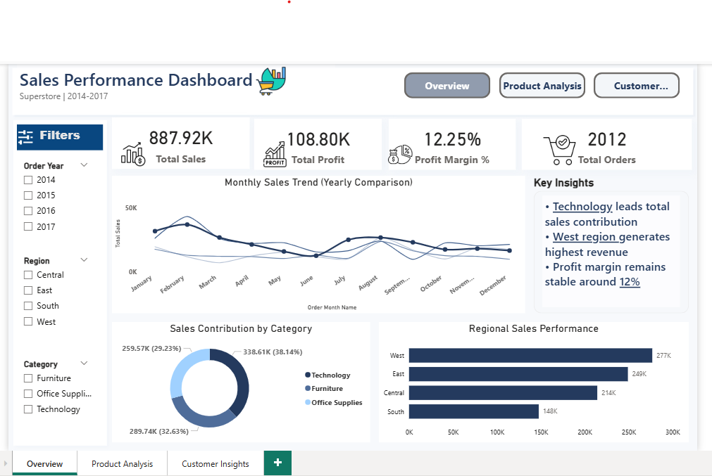
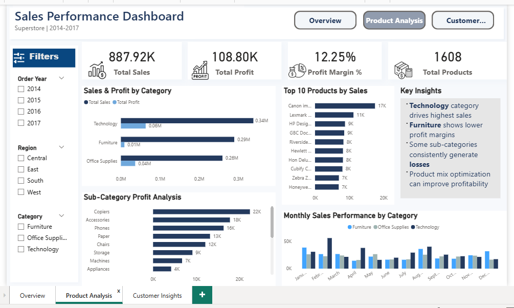
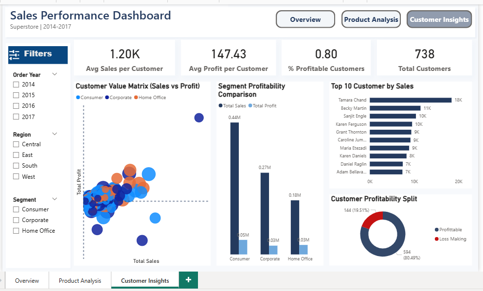

# 📊 Sales Performance Dashboard – Power BI

## 📌 Project Overview
This project is a **professional Power BI Sales Performance Dashboard** built using the **Sample Superstore dataset (2014–2017)**.

The dashboard is designed to help business stakeholders analyze **sales performance, profitability, product trends, and customer behavior** through clean visuals and interactive insights.

---

## 📄 Dashboard Pages

### 1️⃣ Overview
Provides a high-level business summary:
- Total Sales, Total Profit, Profit Margin %
- Monthly sales trend (year-over-year comparison)
- Category contribution analysis
- Regional sales performance
- Key business insights panel

---

### 2️⃣ Product Analysis
Focuses on product-level performance:
- Sales & profit by category
- Top 10 products by sales
- Sub-category profit analysis
- Monthly sales performance by category
- Profitability improvement insights

---

### 3️⃣ Customer Insights
Analyzes customer behavior and value:
- Average sales & profit per customer
- Customer value matrix (Sales vs Profit)
- Segment profitability comparison
- Top customers by sales
- Profitable vs loss-making customers

---

## 🛠 Tools & Technologies
- **Power BI**
- **DAX**
- **Power Query**
- **Microsoft Excel**

---

## 📂 Dataset
- Sample Superstore Dataset (2014–2017)

---

## 🎯 Key Skills Demonstrated
- Data Cleaning & Transformation
- DAX Measures & KPIs
- Interactive Dashboard Design
- Business Insight Development
- Professional UI/UX Dashboard Layout

---

## 👤 Author
**Ajay**  
Freelance Data Analyst | Power BI | Excel | SQL

